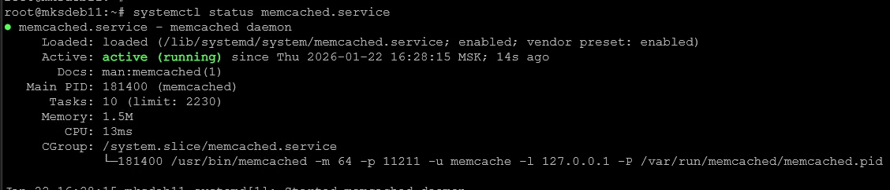
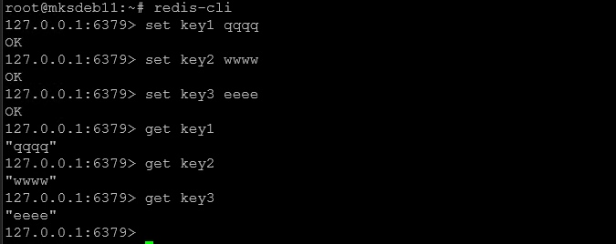
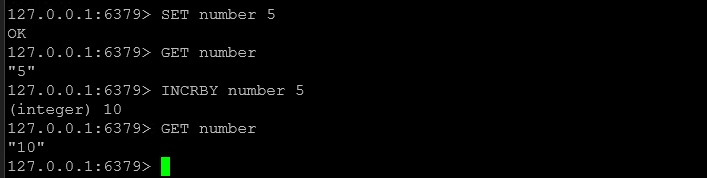

# Домашнее задание к занятию "`Кеширование Redis/memcached`" - `Милованов Константин`
[Домашнее задание](https://github.com/netology-code/sdb-homeworks/blob/main/11-02.md)

### Задание 1. Кеширование

Приведите примеры проблем, которые может решить кеширование.

Ответ:

Основная причина появления кеширования заключается в том, что доступ к данным из БД (постоянной памяти) занимает значительное время. С кешированием данные должны храниться в быстрой оперативной памяти, которая работает быстрее, и данные извлекаются оттуда при частых одинаковых запросах. Улучшается производительность.

Проблемы, которые решаются кешированием:
1. Высокая задержка. Получение данных из основного источника (удаленная БД, диск, внешнее API) занимает слишком много времени. Хранение кэша в памяти снижает задержку.
2. Огромное количество однотипных запросов нагружает БД и может привести к проблемам. Кеширование популярных запросов снижает нагрузку на БД.
3. Сложные математические расчеты, генерация отчетов или обработка данных занимают много ресурсов CPU/GPU при каждом обращении. Сохранение готового результата вычислений в кеше позволяет мгновенно отдавать его при повторном запросе.

---

### Задание 2. Memcached

Установите и запустите memcached.

Приведите скриншот systemctl status memcached, где будет видно, что memcached запущен.

Ответ (скриншот):

---

### Задание 3. Удаление по TTL в Memcached

Запишите в memcached несколько ключей с любыми именами и значениями, для которых выставлен TTL 5.

Приведите скриншот, на котором видно, что спустя 5 секунд ключи удалились из базы.

Ответ (скриншот):

---

### Задание 4. Запись данных в Redis

Запишите в Redis несколько ключей с любыми именами и значениями.

Через redis-cli достаньте все записанные ключи и значения из базы, приведите скриншот этой операции.

Ответ (скрин):

### Задание 5*. Работа с числами

Запишите в Redis ключ key5 со значением типа "int" равным числу 5. Увеличьте его на 5, чтобы в итоге в значении лежало число 10.

Приведите скриншот, где будут проделаны все операции и будет видно, что значение key5 стало равно 10.

